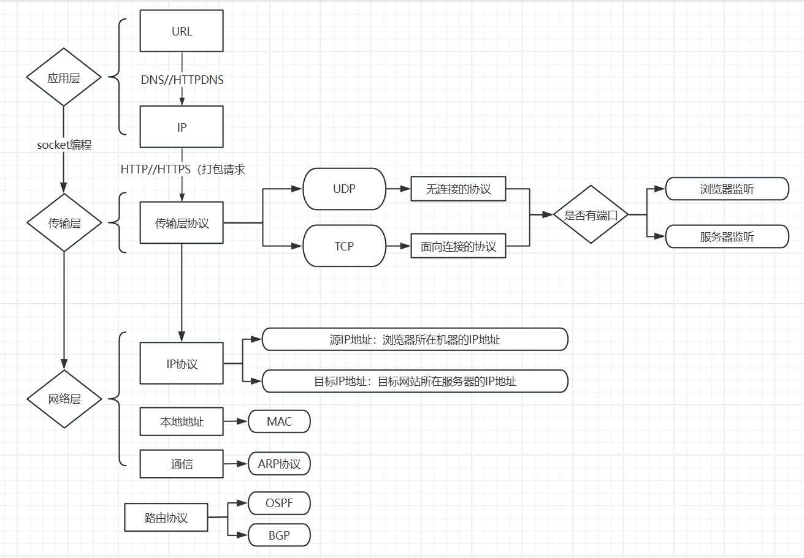
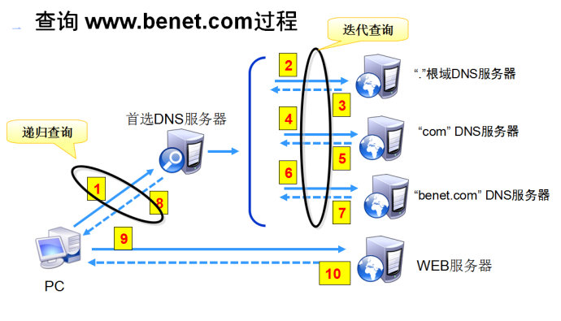

## 协议三要素

可见协议三要素：
- **语法**，就是这一段内容要符合一定的规则和格式。例如，括号要成对，结束要使用分号等。
- **语义**，就是这一段内容要代表某种意义。例如数字减去数字是有意义的，数字减去文本一般来说就没有意义。
- **顺序**，就是先干啥，后干啥。例如，可以先加上某个数值，然后再减去某个数值

## 常用的网络协议

|  层级  |  名称  |  简述  |
|  :----:  |  :----:  |  :----  |
| 应用层 | URL |  互联网上标准资源的地址，具有唯一性  |
| 应用层 | DNS//HTTPDNS |  域名系统，转换为计算机可以理解的IP地址  |
| 应用层 | HTTP//HTTPS | ... |
| 应用层 | socket | ... |
| 传输层 | UDP | ... |
| 传输层 | TCP | ... |
| 网络层 | MAC | ... |
| 网络层 | ARP | ... |
|  | OSPF | ... |
|  | BGP | ... |

### 一、URL
英文全称：Uniform Resource Locator  
中文：统一资源定位器  

1. 概念
   - URL是对互联网上得到的资源的位置和访问方法的一种简洁表示，是互联网上标准资源的地址
   - URL它具有**全球唯一性**，正确的URL应该是可以通过浏览器打开此网页的，但如果您访问外网，会提示网页无法打开，这并不能说明这个URL是错误的。只不过在国内不能访问而已。  
:exclamation:**注意，Windows 主机不区分 URL 大小写，但是，Unix/Linux 主机区分大小写。**  
2. 组成部分
   - 资源类型
   - 存放资源的主机域名
   - 资源文件名
- 一般组成部分  
  `protocol :// hostname[:port] / path / [;parameters][?query]#fragment`
  - protocol(协议)  
    指定使用的传输协议，最常用的是HTTP协议，它是目前WWW中应用最广的协议
    ```
    http 通过HTTP访问该资源。 格式 HTTP://
    https 通过安全的HTTPS访问该资源。 格式 HTTPS://
    ftp 通过FTP访问资源。 格式 FTP://
    ```  
    > 一般来说，https开头的URL要比http开头的更安全，因为这样的URL传输信息是采用了加密技术
  - hostname(主机名)  
  是指存放资源的服务器的域名系统(DNS) 主机名或 IP 地址  
  有时，在主机名前也可以包含连接到服务器所需的用户名和密码  
  （格式：username:password@hostname） 
  - port(端口)  
    - HTTP缺省工作在TCP协议80端口，用户访问网站`http://`打头的都是标准HTTP服务  
    - HTTPS缺省工作在TCP协议443端口  
  - path(路径)  
    由零或多个"/"符号隔开的字符串，一般用来表示主机上的一个目录或文件地址  
  - parameters(参数)  
    这是用于指定特殊参数的可选项  
  - query(查询)  
    可选，用于给动态网页（如使用CGI、ISAPI、PHP/JSP/ASP/ASP。NET等技术制作的网页）传递参数，可有多个参数，用“&”符号隔开，每个参数的名和值用“=”符号隔开。  
  - fragment(信息片断)  
    信息片断，字符串，用于指定网络资源中的片断。例如一个网页中有多个名词解释，可使用fragment直接定位到某一名词解释。  

### 二、DNS//HTTPDNS
#### 1.DNS
- 概念
  DNS（域名系统）是互联网的一项核心服务，它将人类易于记忆的域名`www.baidu.com`转换为计算机可以理解的IP地址`119.75.217.109`，从而使用户能够方便地访问互联网  
- 作用
  1. **域名解析**：DNS的主要功能是将域名解析为IP地址。用户在浏览器中输入域名后，DNS服务器会将该域名转换为相应的IP地址，使用户能够访问目标网站。  
  2. **提高访问速度和稳定性**：优质的DNS服务不仅解析速度快，还能屏蔽恶意网址、智能纠错、解决部分DNS污染等问题，从而提高上网速度和稳定性。  
  3. **安全性**：一些恶意的DNS服务器可能会劫持用户的网络请求，插入广告或进行中间人攻击。选择可靠的DNS服务器可以避免这些安全问题。
- DNS查询过程
  
  1. **客户端请求**：用户的计算机向首选DNS服务器发送域名查询请求
  2. **首选DNS服务器查询**：如果首选DNS服务器有该域名的缓存记录，则直接返回IP地址；否则，向根DNS服务器查询
  3. **根DNS服务器查询**：根DNS服务器返回一级域`如.com`的DNS服务器地址
  4. **逐级查询**：首选DNS服务器依次向一级域、二级域等DNS服务器查询，直到找到目标域名的IP地址
  5. **返回结果**：首选DNS服务器将最终的IP地址返回给用户的计算机，用户即可访问目标网站  
- DNS解析
  - 递归查询(客户端和local DNS之间)
  - 迭代查询(DNS服务器之间)
  1. 递归查询  
     如果DNS服务器查不到该域名，那么它将重新以客户端的身份向其他DNS服务器发送查询请求报文，客户端只要等待最终结果即可  
     ```
     fun dns(client: String, server: String, domain: String): String{
           if (server 查询 domain 成功){
                 return "ip"
           }
           //server以客户端的身份递归查询
           return dns(server, "其他DNS服务器", domain)
     }
     ```
  2. 迭代查询  
     如果DNS服务器查不到该域名，它不会替客户端完成后续的查询工作，而是回复下一步应当向哪一个域名服务器进行查询，随后客户端重新向这个新的 DNS 服务器发送查询请求  
     ```
     fun dns(client: String, server: String, domain: String): String{
           while(true){
                 if(server 查询 domain 成功){
                       return "ip"
                 } else {
                       //client继续以客户端身份迭代查询
                       server = "其他DNS服务器"
                 }
           }
     }
     ```
- 更换公共DNS服务器的原因
  1. **提高解析速度**：一些公共DNS服务器（如`Google Public DNS`、`CloudFlare DNS`）提供更快的解析速度，能够显著提高上网体验
  2. **增强安全性**：公共DNS服务器通常具备屏蔽恶意网址、保护隐私等功能，能够提高上网的安全性
  3. **解决DNS劫持问题**：更换公共DNS服务器可以避免ISP提供的DNS服务器可能存在的劫持问题

#### 2.HTTPDNS
- 概念  
  HTTPDNS是自己搭建基于HTTP协议的服务器，当客户端需要DNS解析的时候，不再向local 发送DNS查询报文，而是直接通过请求直接访问，HTTPDNS接口。而服务端则根据客户端的位置和所属运营商，返回就近的IP地址。
- 优势  
  - **降低时延**：缩短了查询链路，不像DNS查询那样需要访问多台DNS服务器才能得到最终的结果；
  - **域名防劫持**：域名解析请求直接发送至HTTPDNS服务器，绕过运营商Local DNS，避免域名劫持问题；
  - **调度精准**：由于DNS服务器端获取的是真实客户端IP而非Local DNS的IP，能够精准基于客户端位置、运营商信息，获得最精准的解析结果，让客户端就近接入业务节点
  - **快速生效**：域名解析结果变更时，HTTPDNS服务没有传统DNS服务多级缓存的影响，域名更新能够更快地覆盖到全量客户端
